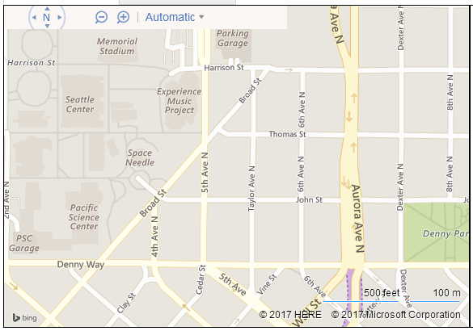
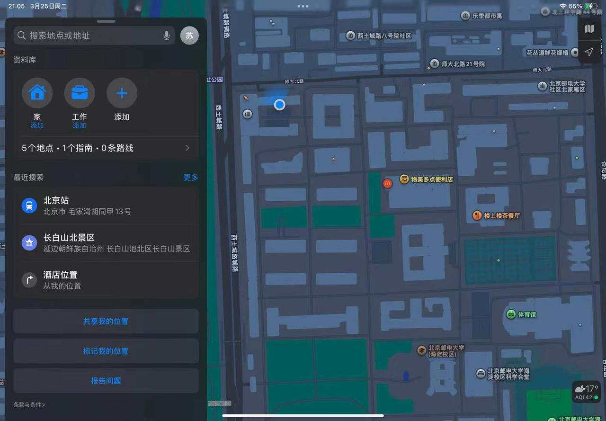

# 环球寻光纪
## 1 项目介绍
### 1.1 项目概述
{align=right width="45%"}“环球寻光记”是一款专注于个性化旅游的创新系统，以全球自然风光、名胜古迹和高校校园为核心主题。系统架构由推荐、地图、打卡、搜索等模块组成，依托强大的底层数据库协同运作。后端采用Python语言，借助Flask框架与JavaScript搭建服务，处理业务逻辑；前端通过Flask模板引擎渲染页面，实现丰富交互。系统将在本地部署，为用户提供“千人千面”的个性化旅游体验。

### 1.2 模块设计
#### 1.2.1 推荐模块
该模块依据自然风光、名胜古迹、高校校园类别和地点评分数据，为用户生成个性化推荐列表。界面借鉴小红书卡片式布局，展示地点首图、名称和评分。点击卡片可跳转至详情页，查看介绍、评论和标签。系统根据用户点击行为和停留时长优化推荐结果。

#### 1.2.2 地图模块
{align=right width="45%"}地图模块依托数据库经纬度信息，在世界地图上标记展示地点，并支持缩放、拖拽和标签筛选。双模式导航包括跨地点导航和内部导航，分别用于不同景点间和大型地点内部的路线规划。用户可通过标签查看目标地点分布，输入起点和终点获取导航路线。

#### 1.2.3 打卡模块
{align=right width="45%"}
打卡模块用于用户记录旅行足迹、分享瞬间和参与社区互动。用户可发布图文打卡内容，填写地点名称、上传图片、添加标题和正文描述，并关联地理位置标签。

#### 1.2.4 搜索模块
搜索模块可帮助用户查找附近设施，支持模糊输入，能根据距离排序。还可借助大模型API实现自然语言交互生成行程方案，并结合实时数据优化方案。

### 1.3 数据库设计
#### 1.3.1 数据库选型
采用MySQL存储结构化数据，支持高并发访问和数据扩展性，能应对平台数据量增长。

#### 1.3.2 核心数据表设计
|表名|字段名|类型|说明|
|---|---|---|---|
|places|id|INT|主键，自增ID|
||name|VARCHAR(255)|地点名称|
||city|VARCHAR(255)|所在城市|
||address|TEXT|详细地址|
||rating|FLOAT|综合评分（1 - 5分）|
||description|TEXT|地点介绍|
||tags|JSON|标签数组（如["自然风光"， "雪山"]）|
|checkins|user_id|INT|用户ID|
||place_id|INT|关联地点ID|
||content|TEXT|打卡内容|
||images|JSON|图片URL数组|

### 1.4 技术选型
|模块|技术方案|说明|
|---|---|---|
|后端|Python + Flask|轻量级框架，支持快速开发与API集成|
|前端|Flask模板 + JavaScript|实现动态交互与地图渲染|
|地图服务|如Mapbox API|提供全球地图数据与导航功能|
|大模型|如OpenAI GPT - 4|自然语言处理与行程生成|

### 1.5 部署方式
1. 克隆代码仓库，安装依赖（Python: `pip install -r requirements.txt`；前端：`npm install`）；
2. 配置MySQL数据库连接信息；
3. 启动后端服务：`flask run`；
4. 启动前端服务：`npm start`；
5. 访问`http://localhost:3000`使用系统。

### 1.7 核心成员与项目群组
|成员|项目角色|负责事项|
|---|---|---|
|@张耕源|组长|负责团队进度跟进，制定项目目标，撰写文档，配合组员书写模块代码|
|@苏君兰|技术探索|负责学习技术，寻找解决方案，配合项目整体进行模块代码书写|
|@严张扬|技术实现|负责实现技术，配合项目整体进行模块代码书写|

## 2 问题分析
### 2.1 推荐模块
#### 2.1.1 推荐算法设计
依据评价推荐时，采用堆排序思想构建大小为10的小顶堆，调整堆时间复杂度为$O(log10)$，整体时间复杂度为$O(nlog10)$。融合个人兴趣推荐时，量化用户兴趣，为兴趣标签赋予权重，通过加权公式计算推荐得分。

#### 2.1.2 查询功能实现
查询名称时，哈希查找算法时间复杂度接近$O(1)$；模糊关键字查询采用KMP算法，时间复杂度为$O(n + m)$。查询结果按热度和评价排序，根据数据量大小选择快速排序（平均时间复杂度$O(nlogn)$）或插入排序（最好情况时间复杂度$O(n)$）。

### 2.2 地图模块
#### 2.2.1 单景点导航
用图结构建模道路，为单行线和施工路段设置相应标识。最短路径算法选择A*算法，引入启发函数（如欧几里得距离）提高搜索效率。

#### 2.2.2 多景点导航
路径组合爆炸问题可通过动态规划算法解决，将问题分解为子问题，记录子问题解避免重复计算。

#### 2.2.3 导航策略与界面设计
导航策略包括最短距离和最短时间策略，后者需考虑道路拥挤度和交通工具速度。地图与路径展示借助专业地图API，用不同颜色区分路线段，添加方向指示箭头和距离标识。

### 2.3 搜索模块
#### 2.3.1 基于位置的查询
基于位置查询时，使用堆数据结构排序距离，用空间索引技术（如四叉树）快速定位设施。

#### 2.3.2 基于类别查询
基于类别查询采用编辑距离算法实现模糊匹配，查询结果按距离排序。

#### 2.3.3 大模型接入
在后端配置开发工具和依赖库，编写代码实现与大模型API交互，处理请求和响应数据。

### 2.4 打卡模块
#### 2.4.1 旅游日记撰写与管理
多媒体存储方面，文字存数据库，图片和视频存文件系统，定期备份。数据结构设计上，用“diaries”表存储日记信息，对常用查询字段建立索引，采用分页查询技术。

#### 2.4.2 旅游日记浏览与推荐
推荐算法优化借助自然语言处理技术提取日记关键词，用余弦相似度计算与用户兴趣标签的相似度。热度与评分计算根据浏览量和用户打分，设置权重并对热度衰减处理。

#### 2.4.3 旅游日记交流功能
基于目的地查询日记，对“destination”字段建立索引，按热度和评分排序。精确查询日记名称使用精确查找算法，全文检索集成Elasticsearch。日记压缩采用无损压缩算法，使用AIGC算法根据照片生成旅游动画。

## 3 项目目标
|功能实现目标|用户体验目标|技术性能目标|数据管理目标|
|---|---|---|---|
|1. 精准推荐 2. 便捷地图导航 3. 高效搜索功能 4. 互动打卡模块|1. 个性化体验 2. 界面友好 3. 丰富交流体验|1. 高效后端服务 2. 流畅前端交互 3. 可靠数据存储|1. 数据安全 2. 数据优化|

### 3.1 功能实现目标
精准推荐通过融合多维度数据，确保推荐列表至少80%内容符合用户需求。便捷地图导航实现全球定位和双模式导航，跨地点导航准确率超95%，内部导航覆盖大型地点80%主要建筑与路径。高效搜索功能基于位置和类别快速搜索，基于位置查询1秒内返回结果，基于类别查询匹配准确率达85%以上，大模型生成详细行程方案。互动打卡模块支持图文打卡，建立日记查询与排序功能，查询响应时间控制在2秒以内，集成全文搜索引擎。

### 3.2 用户体验目标
个性化体验通过系统学习优化服务，使用户满意度达85%以上。界面友好借鉴优秀设计理念，操作流畅度达90%以上。丰富交流体验鼓励用户互动，每个用户平均每月参与互动不少于5次。

### 3.3 技术性能目标
高效后端服务在高并发下响应时间不超3秒，错误率控制在5%以内。流畅前端交互页面加载时间控制在2秒以内。可靠数据存储采用MySQL，支持高并发访问，数据扩展性良好，数据丢失率为0。

### 3.4 数据管理目标
数据安全通过定期备份和异地存储，确保数据备份成功率达100%。数据优化通过建立索引和分页查询，缩短常用查询操作响应时间50%以上。

## 4 技术方案
### 4.1 推荐模块
基于堆排序思想构建小顶堆实现部分排序，使用`heapq`库。兴趣融合策略通过量化用户兴趣，结合热度、评价和兴趣匹配得分计算推荐得分。查询功能中，哈希查找用字典实现，KMP算法用于模糊查询，根据数据量选择快速排序或插入排序对查询结果排序。

### 4.2 地图模块
单景点导航使用`networkx`库构建图结构，实现A*算法并自定义启发函数。多景点导航采用动态规划算法解决路径组合爆炸问题。导航策略与界面设计调用百度地图API，实现地图初始化、路径展示和界面优化。

### 4.3 搜索模块
基于位置的查询使用`heapq`构建小顶堆实现距离排序，用`rtree`库实现四叉树空间索引。基于类别查询采用编辑距离算法模糊匹配，按距离排序查询结果。

## 5 月度里程碑
（点击图片可查看完整表格，此处未详细列出）

## 6 任务拆解
张耕源负责系统架构与数据处理，包括数据库设计搭建、数据处理存储逻辑、系统架构规划和部分地图模块开发的数据支持。苏君兰负责推荐、搜索与算法实现，涵盖推荐模块开发、兴趣融合策略实现、搜索模块开发和查询结果排序优化。严张扬负责地图模块与界面优化，包括单景点和多景点导航功能开发、导航策略与界面设计以及整体界面优化与交互设计。

## 7 风险管理
|风险类型|风险名称|可能风险|应对方法|
|---|---|---|---|
|技术风险|算法性能风险|推荐和查询算法优化不足影响推荐精准度和查询效率|不同数据量级下压力测试，优化代码逻辑或引入缓存机制|
||API依赖风险|地图和大模型API异常影响功能|引入多供应商备份方案，设置本地降级策略|
||技术选型风险|技术框架、数据库等存在缺陷影响系统运行|评估技术兼容性，定期跟进版本更新|
|人员风险|技术能力风险|成员技术水平影响开发进度和功能实现|组织新技术培训，设立技术攻坚小组|
|数据风险|标签数据冗余与冲突|标签不规范降低推荐精准度|制定标签规范，清理冗余标签|
||实时数据更新延迟|行程方案因数据延迟不准确|对接高频数据源，设置缓存和人工复核机制|
||海量日志存储压力|日志处理延迟影响推荐模型迭代|部署分布式日志系统，制定日志留存策略|
||图片存储成本激增|用户上传图片导致存储成本增长|设置上传阈值，自动压缩图片，采用分层存储方案| 